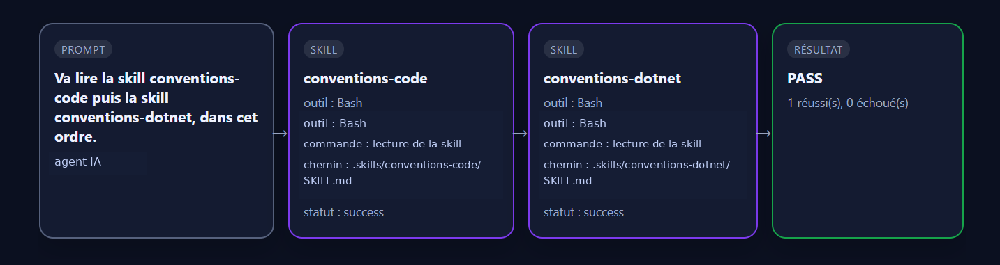

# Pathtrace

[](https://github.com/maximecarrere41-art/pathtrace/actions/workflows/tests.yml)


> Projet en version initiale — support de Codex CLI et Claude Code.

Pathtrace teste **le chemin suivi par un agent IA** : les skills chargées, les outils utilisés, les commandes exécutées et leur ordre.

Il complète les tests classiques : au lieu de vérifier uniquement la réponse finale, il vérifie aussi **comment l’agent y est arrivé**.

```text
prompt → agent → adaptateur → trace JSON → assertions YAML → rapport → graphe HTML
```

## Aperçu



## Prérequis

- Python 3.11 ou supérieur ;
- Codex CLI pour utiliser le framework `codex` ;
- Claude Code pour utiliser le framework `claude-code`.

## Installation

```bash
python -m pip install -e .
```

Pour contribuer au projet :

```bash
python -m pip install -e ".[dev]"
```

## Deux façons de l’utiliser

### 1. Observer puis tester une session manuelle

À choisir pour explorer un agent, comprendre une exécution réelle ou vérifier ponctuellement un tour déjà lancé par un humain.

#### Codex CLI

```bash
pathtrace install --framework codex
codex
pathtrace test --latest --tests pathtrace.yaml --report --graph
```

#### Claude Code

```bash
pathtrace install --framework claude-code
claude
pathtrace test --latest --tests pathtrace.yaml --report --graph
```

Dans ce mode, **Pathtrace ne lance pas le prompt**. Il installe les hooks de l’agent choisi, écrit la trace pendant la session, puis teste cette trace.

### 2. Lancer une campagne automatisée

À choisir pour la non-régression, la CI ou l’exécution de plusieurs prompts et scénarios YAML.

#### Codex CLI

```bash
pathtrace run --tests tests/scenarios/ --framework codex --report --graph
```

Pathtrace lance les scénarios avec `codex exec`. Les hooks Codex nécessaires sont installés ou complétés automatiquement avant l’exécution.

#### Claude Code

```bash
pathtrace run --tests tests/scenarios/ --framework claude-code --report --graph
```

Pathtrace lance les scénarios avec `claude -p`. Les hooks Claude Code sont fusionnés automatiquement dans `~/.claude/settings.json` : aucune édition manuelle ni exécution préalable de `pathtrace install` n’est nécessaire.

Dans les deux cas, Pathtrace :

1. lance le prompt avec le runner de l’agent ;
2. récupère la trace produite par l’adaptateur ;
3. applique les assertions YAML ;
4. écrit les rapports et graphes ;
5. passe au scénario suivant.

## Exemple de trace

Le format de trace reste identique quel que soit l’agent. Seules les valeurs natives, comme `framework`, `tool` ou `path`, changent.

### Codex CLI

```json
{
  "prompt": "Corrige le bug puis lance les tests",
  "framework": "codex",
  "summary": {
    "skills": ["conventions-code"],
    "commands": ["python -m pytest"],
    "tools": ["Read", "Bash"]
  },
  "events": [
    {
      "type": "skill",
      "name": "conventions-code",
      "tool": "Read",
      "path": ".agents/skills/conventions-code/SKILL.md",
      "status": "success"
    },
    {
      "type": "tool_call",
      "name": "Bash",
      "command": "python -m pytest",
      "status": "success"
    }
  ]
}
```

### Claude Code

```json
{
  "prompt": "Corrige le bug puis lance les tests",
  "framework": "claude-code",
  "summary": {
    "skills": ["conventions-code"],
    "commands": ["python -m pytest"],
    "tools": ["Read", "Bash"]
  },
  "events": [
    {
      "type": "skill",
      "name": "conventions-code",
      "tool": "Read",
      "path": ".claude/skills/conventions-code/SKILL.md",
      "status": "success"
    },
    {
      "type": "tool_call",
      "name": "Bash",
      "command": "python -m pytest",
      "status": "success"
    }
  ]
}
```

Le cœur ne connaît aucun nom de skill, commande ou outil. Chaque adaptateur traduit les événements natifs vers un modèle commun.

## Assertions YAML

### Session manuelle

```yaml
version: 1

tests:
  - name: le code est validé
    assertions:
      - type: must_include
        event: skill:conventions-code

      - type: must_include
        event: tool_call:Bash
        where:
          command: "*pytest*"
```

### Campagne automatisée avec Codex

```yaml
version: 1
framework: codex

defaults:
  project_dir: ..
  timeout: 600

scenarios:
  - name: correction suivie des tests
    prompt: |
      Corrige le bug décrit dans issue.md.
      Lance les tests avant de terminer.
    assertions:
      - type: must_include
        event: tool_call:Bash
        where:
          command: "*pytest*"
```

### Campagne automatisée avec Claude Code

```yaml
version: 1
framework: claude-code

defaults:
  project_dir: ..
  timeout: 600

scenarios:
  - name: vérification de sécurité
    prompt: Analyse les changements et vérifie qu’aucune commande destructive n’est utilisée.
    tests_file: assertions/security.yaml
```

Un scénario utilise soit `assertions` directement, soit `tests_file` pour réutiliser un fichier YAML manuel.

## Architecture extensible

Deux abstractions sont séparées :

- `FrameworkAdapter` observe les événements natifs et produit une trace commune ;
- `AgentRunner` lance un prompt en mode non interactif.

Pour ajouter un autre agent, il suffit d’implémenter son adaptateur et son runner. Le moteur YAML, les rapports et les graphes restent inchangés.

## Documentation

- [Guide pas à pas et choix du mode](docs/quickstart.md)
- [Campagnes automatisées](docs/automated-runs.md)
- [Format JSON et propriétés abstraites](docs/trace-format.md)
- [Runner et adaptateur : rôles différents](docs/runners-and-adapters.md)
- [Capture et propriétés Codex](docs/codex-adapter.md)
- [Intégration Claude Code](docs/claude-code-adapter.md)
- [Créer un adaptateur et un runner](docs/adapters.md)

## Développement

```bash
python -m pytest
```

## Feuille de route

- export OpenTelemetry ;
- prise en charge d’autres agents et frameworks ;
- amélioration des rapports et exemples publics.

## Auteur

Créé et maintenu par [Maxime Carrere](https://github.com/maximecarrere41-art).

## Licence

Distribué sous licence MIT. Voir [LICENSE](LICENSE).